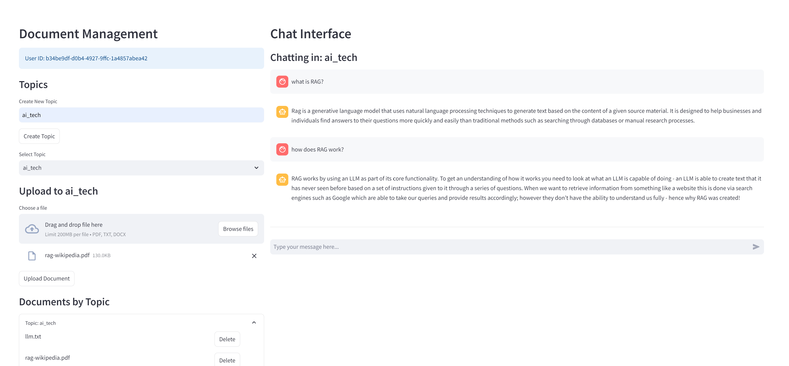

# Multi-modal Document Intelligence System

A document processing and question-answering system leveraging RAG (Retrieval Augmented Generation), LangGraph, and multi-modal AI technologies to provide intelligent document analysis and contextual conversations.


_Screenshot of the system interface showing document processing and chat functionality_

## Features

### RAG Pipeline
- retrieval-augmented generation using LangGraph
- Topic-specific vector stores with FAISS
- Hybrid retrieval combining semantic and keyword search
- Efficient document chunking and embedding
- Cross-document context aggregation
- Context-aware response generation

### Document Intelligence
- Multi-format document processing (PDF, DOCX, TXT, Images)
- OCR with Tesseract and layout analysis with OpenCV
- Intelligent document chunking and indexing
- Multi-lingual document support
- Metadata extraction and management

### Conversation Management
- User and topic separation for organized interactions
- Persistent chat history by user and topic
- Thread-based conversation tracking
- Context retention across chat sessions
- Real-time streaming responses

### Semantic Search & Retrieval
- FAISS vector store with dynamic scaling
- Cross-lingual semantic search
- Topic-specific document indexing
- Efficient similarity matching
- Automatic index optimization

## System Architecture

The system follows a modular architecture with the following key components:

### Backend (FastAPI)

- Document processing pipeline
- RAG implementation
- Vector search
- LLM integration
- Multi-threading support

### Frontend (Streamlit)

- Document management interface
- Chat UI
- Search interface
- Real-time updates
- Topic management

### Core Components

- Document Processor: Handles parsing and text extraction
- RAG Pipeline: Manages retrieval and generation
- Semantic Search: Enables intelligent querying
- LLM Integration: Provides language model capabilities

## Technology Stack

### Backend Technologies

- Python
- FastAPI
- LangChain (LangGraph)
- HuggingFace Transformers
- FAISS
- Tesseract OCR
- OpenCV
- PyTorch
- Sentence Transformers

### Frontend Technologies

- Streamlit
- Async streaming
- WebSocket support
- Dynamic UI components

### Deployment

- Docker containerization
- Local deployment support
- Environment configuration
- Resource management

## Installation & Setup

### Prerequisites

- Python 3.8+
- Tesseract OCR
- CUDA-compatible GPU (optional)

### Installation Steps

1. Clone the repository

2. Install Python dependencies

```bash
pip install -r requirements.txt
```

3. Install Tesseract OCR

```bash
# Ubuntu/Debian
sudo apt-get install tesseract-ocr

# macOS
brew install tesseract
```

4. Start the application

```bash
# in the project directory
# Start backend
uvicorn src.api.main:app --reload

# Start frontend (new terminal)
streamlit run src/frontend/app.py
```

## Usage Guide

### Document Management

1. Upload Documents

- Click "Upload Document" button
- Select document file(s)
- Choose topic/category
- Wait for processing completion

2. Organize Documents

- Create and manage topics
- View documents by topic
- Delete unwanted documents
- Search across collections

3. Chat Interface

- Select topic/document context
- Enter questions in chat
- View streamed responses
- Access chat history

## Implementation Details

### Document Processing Pipeline

- Format detection and validation
- Text extraction and OCR
- Content preprocessing
- Chunking strategies
- Vector embedding

### RAG Implementation

- Document retrieval
- Context selection
- Response generation
- Source tracking
- History management

### Search Functionality

- Vector indexing
- Similarity computation
- Result ranking
- Cross-lingual support

### RAG Pipeline Implementation
```python
class RAGPipeline:
    def __init__(self, llm):
        self.llm = llm
        self.memory = MemorySaver()
        self.embeddings = HuggingFaceEmbeddings(
            model_name="sentence-transformers/all-MiniLM-L6-v2"
        )
        self.vector_stores = {}  # Topic-specific stores
        self.graph = self._build_graph()

    async def chat(self, message, user_id, topic_id, config):
        # Process chat messages with context retrieval
        async for messages in self.graph.astream(
            inputs={
                "messages": [HumanMessage(content=message)],
                "user_id": user_id,
                "topic_id": topic_id
            },
            config=config
        ):
            yield messages
```

### Vector Store Management
```python
async def add_documents(self, documents, topic_id, metadata=None):
    processed_docs = []
    chunks = []
    
    # Process and chunk large documents
    for doc_id, content in documents.items():
        text_chunks = self.text_splitter.split_text(content)
        chunks.extend(text_chunks)
        
        # Create document objects with metadata
        processed_docs.extend([
            Document(
                page_content=chunk,
                metadata={
                    **(metadata or {}),
                    "chunk_index": len(processed_docs) + i,
                }
            )
            for i, chunk in enumerate(text_chunks)
        ])

    # Add to topic-specific vector store
    if topic_id not in self.vector_stores:
        self.vector_stores[topic_id] = FAISS.from_documents(
            processed_docs,
            self.embeddings
        )
    else:
        self.vector_stores[topic_id].add_documents(processed_docs)
```

## Acknowledgments
- HuggingFace for transformer models
- Facebook Research for FAISS
- Tesseract OCR team
- Streamlit team
- FastAPI developers